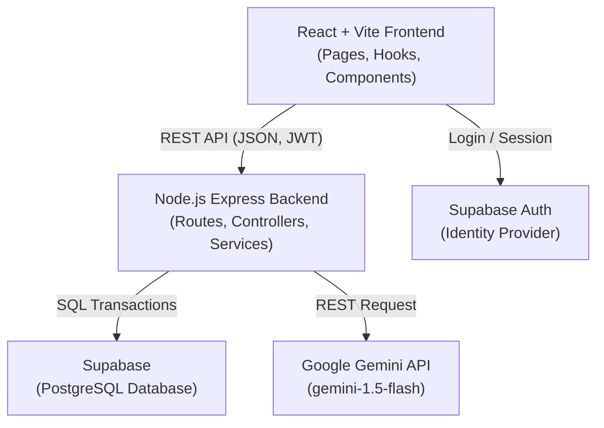
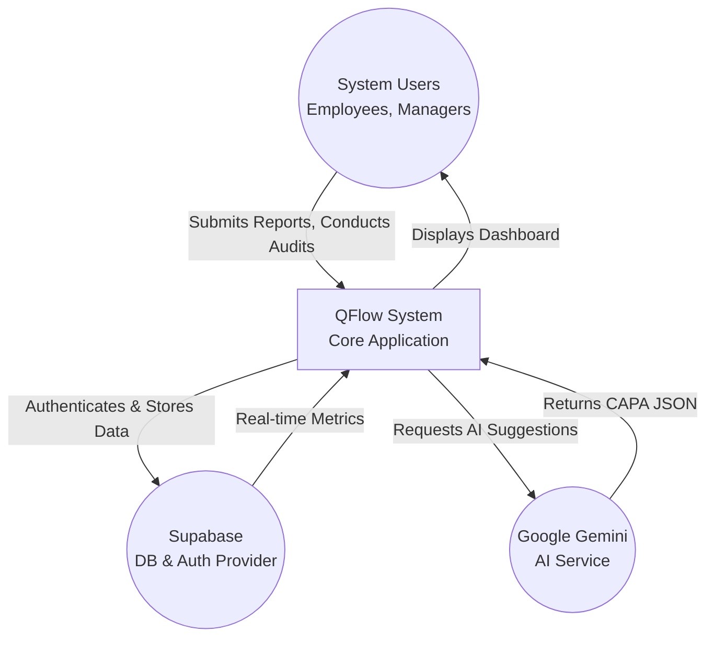
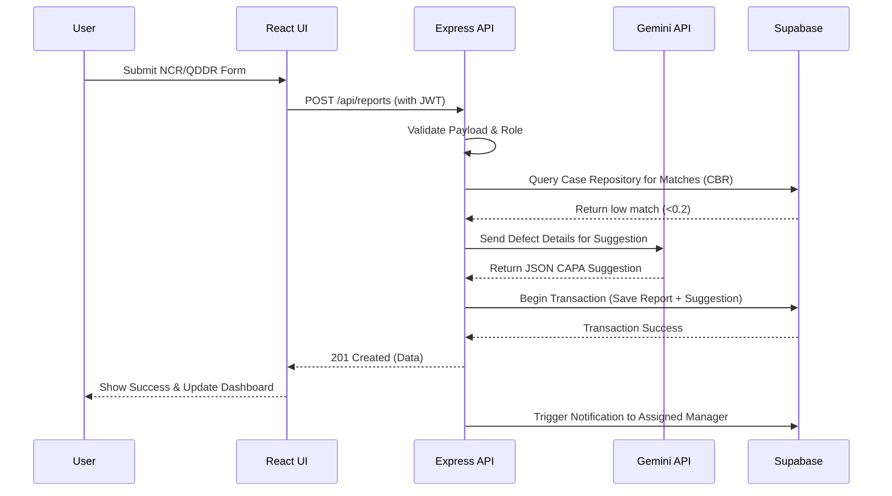
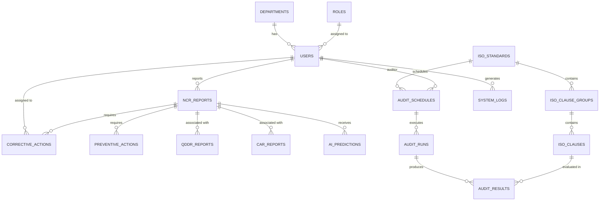
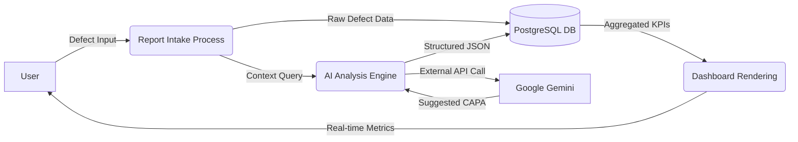

# QFlow System Diagrams

This document contains the structural and behavioral diagrams for the QFlow Quality Management System, rendered in Mermaid syntax.

## 1. System Architecture Diagram
This diagram illustrates the layered architecture of QFlow, separating the React frontend, Express backend, and third-party integrations (Supabase and Google Gemini).



## 2. Use Case Diagram
This diagram outlines the primary actors in the system and their respective interactions with the QFlow modules.

```mermaid
usecaseDiagram
    actor Employee
    actor Manager
    actor Auditor
    actor SystemAdmin
    
    package QFlow {
        usecase "Submit Non-Conformance (NCR)" as UC1
        usecase "Investigate & Formulate CAPA" as UC2
        usecase "Review & Verify Action (VoE)" as UC3
        usecase "Conduct ISO Audit" as UC4
        usecase "Manage Document Control" as UC5
        usecase "View Compliance Dashboard" as UC6
    }
    
    Employee --> UC1
    Manager --> UC2
    Manager --> UC6
    Auditor --> UC3
    Auditor --> UC4
    Auditor --> UC6
    SystemAdmin --> UC5
    SystemAdmin --> UC6
```

## 3. Context Diagram
A high-level view showing the QFlow system boundary and its external interactions.



## 4. Sequence Diagram (CAR & AI Flow)
This diagram maps out the step-by-step API flow when a user submits a report and the AI generates a suggestion.



## 5. Entity Relationship Diagram (ERD)
Based on the current PostgreSQL schema, mapping the relationships between users, reports, corrective actions, and ISO modules.



## 6. Data Flow Diagram (DFD Level 0)
Illustrates how data moves through the system's major processes.


